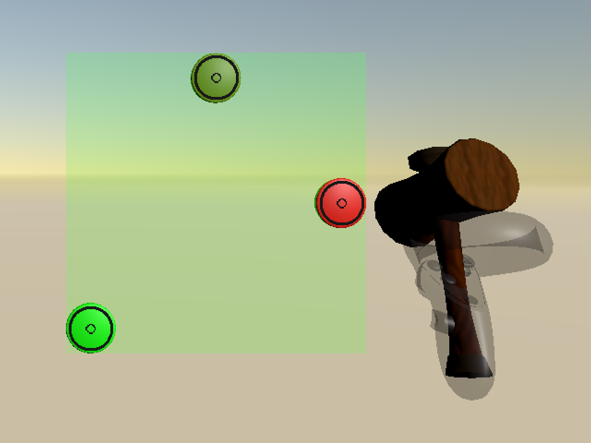

# Whac-A-Mole

A replication of the classic "Whac-A-Mole" arcade game, implemented as a VR game in Unity. This game is largely based on another Unity (boxing) exergame developed by Toni Pesola. 

For game details, see the paper ["SIM2VR: Towards Automated Biomechanical Testing in VR"](https://doi.org/10.1145/3654777.3676452) and the corresponding [GitHub repo](https://github.com/fl0fischer/sim2vr).

Screenshot of the game play:

## Dataset

We release a dataset of 18 people playing different variations of the game. See the above-mentioned paper for details regarding the data collection. The data can be found in the [dataset](https://github.com/aikkala/whac-a-mole/tree/main/dataset) directory, where there is a separate folder for each participant, and a spreadsheet with participant information. Participants 18, 37, and 39 were not used in the paper's user study, they were only invited to play the game to ensure a full dataset of 18 people in case of no-shows.

### Participant Information

The following participant information is available in the spreadsheet: 

- **ID**
- **age**
- **gender**
- **VR-exp**: experience playing VR games, chosen from "none", "some", "lots"
- **exercise**: approximation of how many hours the participant exercises weekly, using a very broad definition of exercise, including, e.g., brisk walking
- **humerus, ulna**: approximation of the humerus/ulna bone's length
- **order**: order of trials, chosen from "alpha", "bravo", "charlie", "delta", "echo", "foxtrot"
- **full-low, -mid, -high**: participant's reported Borg RPE value when considering fatigue felt in the whole body, for target area placement full, mid, or high
- **arm-low, -mid, -high**: participant's reported Borg RPE value when considering fatigue felt in the shoulder and arm, for target area placement full, mid, or high

### Trial Order

- **alpha**: easy, medium, hard or low, mid, high
- **bravo**: easy, hard, medium or low, high, mid
- **charlie**: medium, easy, hard or mid, low, high
- **delta**: medium, hard, easy or mid, high, low
- **echo**: hard, easy, medium or high, low, mid
- **foxtrot**: hard, medium, easy or high, mid, low

## Troubleshooting

When building, if you get an error complaining something about erroneous "guid" for some prefabs/meshes go to "Assets" -> "Reimport all"
